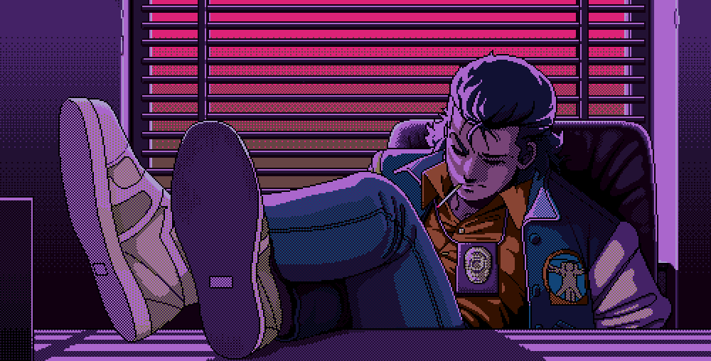

  

   
  

  

---

## 🌟 A Glimpse Into My Journey

🎓 Pursuing **B.Tech in Computer Science & Engineering** @ AKGEC, Ghaziabad  
🌱 Transitioned from **Python basics** → now exploring **Data Analysis** & gradually moving towards **Machine Learning**  
🧠 Passionate about the world of **Artificial Intelligence**, aiming to specialize in **AI/ML** in the future  
💻 Currently building **beginner-friendly projects** in Data Analysis & ML to strengthen my foundation  
🌐 Exploring **Web Development** alongside ML — gaining hands-on experience in full-stack fundamentals  
💡 Strong foundation in **C Programming**, proficient in **Python**, and familiar with **Git/GitHub** & basic web technologies  
🚀 Always eager to **learn, experiment, and innovate** through projects & challenges

---

### 🌟 Featured Projects

- 🎓 **Student Performance Predictor Model**  
  

- ✉️ **Message Encrypter**  
  

- 💻 **CodSoft Internship Project**  
  

---

### 🛠️ Tools & Technologies

#### 🔹 Languages

#### 🔹 Frameworks & Libraries

#### 🔹 Tools & Platforms

---

### 🚀 Goals:
- Build real-world beginner projects
- Crack DSA step by step on LeetCode
- Land my first internship in tech
- Explore AI/ML research in the future

---

### 📊 GitHub Stats

  

---

### 📫 Connect with me

 
  
   
  

---

> “Started with zero commits and infinite curiosity.” 🌱
> 
