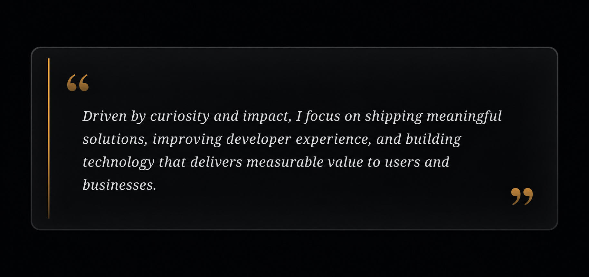

  

  
  
  
  

I'm a Backend-Focused Full-Stack Developer and Open Source Contributor passionate about building scalable software systems, AI-powered applications, and modern web platforms. My work centers around backend architecture, performance optimization, reliability, and intelligent product development.
I enjoy working with distributed systems, automation, and applied machine learning to create practical solutions that solve real-world problems. Beyond building products, I actively contribute to open source, collaborate within large codebases, and continuously explore better ways to design, optimize, and scale software.

> Driven by curiosity and impact, I focus on shipping meaningful solutions, improving developer experience, and building technology that delivers measurable value to users and businesses.

---

## My Engineering Toolkit

> *Technologies, frameworks, cloud platforms, developer tools, and infrastructure I work with...
 
<!-- skillicons here -->

  

---

## Problem Solving Profiles

  

  

  

  

  

## Featured Projects

<table>
<tr>
<td width="50%">

### 🧠 WiseMindOS
AI-powered productivity and life management platform focused on intelligent insights, goal tracking, analytics, journaling, and personal growth.

**Tech Stack:** React • Node.js • Express • MongoDB • AI APIs

</td>

<td width="50%">

### 🎯 InterVuGrid AI
AI-driven interview preparation platform designed to help users practice, evaluate, and improve interview performance through intelligent feedback.

**Tech Stack:** MERN • AI Integration • Authentication • Analytics

</td>
</tr>

<tr>
<td width="50%">

### 🌐 AuraX Social Media
Modern social networking platform featuring authentication, user interactions, content sharing, and scalable backend architecture.

**Tech Stack:** React • Node.js • MongoDB • JWT

</td>

<td width="50%">

### 🛒 E-Commerce Platform
Full-stack commerce solution supporting product management, authentication, user workflows, and responsive user experience.

**Tech Stack:** MERN Stack • REST APIs • Database Design

</td>
</tr>
</table>

---

### 🏆 Highlights
- 🥇 Completed multiple internships (CodSoft, CodeAlpha)  
- 🚀 Deployed my **first ML Web App**: [Student Performance Predictor](https://your-streamlit-link)  
- 📜 Working on my **first research paper in ML**  
- 💡 Built 5+ beginner-to-intermediate projects in Python, ML, and Web Dev

---

### 🎯 Goals  

- 💼 Land paid internships at recognized companies  
- 🤖 Continuously explore and grow in **AI & ML** (my ultimate career path)  
- 🏗️ Build **industry-level projects** that solve real-world problems  
- 🔑 Master **DSA fundamentals** to crack industrial-level coding challenges

---

### ✨ Motto  
> _"Work out the body. Debug the mind. Upgrade the future."_

---

### 📊 GitHub Stats

  
  
  

---

### 🎯 Fun Facts
- 🎮 Gamer at heart (but now I level up in code more than consoles 😅)  
- 🎧 Music addict — headphones on, world off  
- 📚 Forever curious, always learning something new  
- 🏋️‍♂️ Gym mode: “Ctrl + Lift + Repeat”

---

### 📫 Connect with me

  
  
  

 
  
   
  

---

 

  

> “Started with zero commits and infinite curiosity.” 🌱
