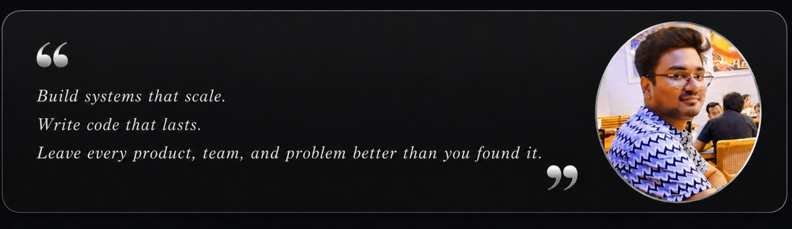

<div align="center">

  

</div>


<p align="left">
  
  
  
  
</p>

I'm a Backend-Focused Full-Stack Developer and Open Source Contributor passionate about building scalable software systems, AI-powered applications, and modern web platforms. My work centers around backend architecture, performance optimization, reliability, and intelligent product development.
I enjoy working with distributed systems, automation, and applied machine learning to create practical solutions that solve real-world problems. Beyond building products, I actively contribute to open source, collaborate within large codebases, and continuously explore better ways to design, optimize, and scale software.

<p align="center">
<a href="https://linkedin.com/in/aaryan-kumar-ai-498-coder"></a>
<a href="https://discord.com/users/aaryan498"></a>
<a href="mailto:kumaraaryan498@gmail.com"></a>
<a href="https://x.com/aaryan498"></a>
<a href="https://instagram.com/its_aaryan.exe"></a>
</p>

<p align="center">
  
</p>

> Driven by curiosity and impact, I focus on shipping meaningful solutions, improving developer experience, and building technology that delivers measurable value to users and businesses.


## My Engineering Toolkit
> *Technologies, frameworks, cloud platforms, developer tools, and infrastructure I work with...*

<br>
<!-- skillicons here -->
<p align="center">
  
</p>


## Selected Work
> *A collection of products and systems built to solve real-world problems through software and intelligent automation.*

<table>
<tr>
<td width="50%" valign="top">

### WiseMindOS
> **Focus Areas:** AI Integration • Productivity Systems • Analytics • Backend Architecture

An AI-powered productivity operating system designed to help individuals plan, execute, and measure long-term personal growth through structured goal management, habit tracking, analytics, and intelligent decision support.

**Key Features**

- Multi-level Goal & Sub-Goal Planning
- Daily Task Management System
- 21-Day & Long-Term Habit Tracking
- Personal Knowledge Management Library
- Notebook & Page-Based Note Taking
- Dedicated Focus Room with Pomodoro Sessions
- Productivity Analytics Dashboard
- FutureTwin AI Assistant for Personalized Guidance
- Progress Monitoring & Performance Insights

**Engineering Stack**

`React` `Node.js` `Express` `MongoDB`
`Context API` `JWT`
`ImageKit` `Multer`
`OpenRouter API`
`Razorpay`
`Vercel` `Render`

<a href="https://wise-mind-os.vercel.app">
  
</a>

<a href="https://github.com/aaryan498/WiseMindOS">
  
</a>

</td>

<td width="50%" valign="top">

### InterVuGrid.AI
> **Focus Areas:** AI Systems • Resume Intelligence • Authentication • Candidate Analytics

An AI-powered interview preparation platform that simulates real-world interview experiences, evaluates candidate performance, and provides actionable feedback to accelerate career readiness.


**Key Features**

- AI Resume Parsing & Analysis
- Real-Time Interview Simulation
- Technical Interview Workflows
- HR & Behavioral Interview Modules
- Coding Assessment Support
- AI-Generated Feedback
- Downloadable Performance Reports
- Interview History & Progress Tracking
- ATS-Friendly Resume Builder
- Job Discovery System *(Planned)*

**Engineering Stack**

`React` `Redux`
`Node.js` `Express`
`MongoDB`
`Google OAuth`
`ImageKit`
`OpenRouter API`
`Razorpay`
`Context API`

<a href="https://intervu-grid-ai.vercel.app">
  
</a>

<a href="https://github.com/aaryan498/InterVuGrid-AI">
  
</a>

</td>
</tr>

<tr>
<td width="50%" valign="top">

### Vanilla
> **Focus Areas:** Real-Time Systems • WebRTC • Social Platforms • Media Processing

A modern social networking platform focused on content sharing, real-time communication, and community engagement through scalable backend services and interactive user experiences.


**Key Features**

- Secure User Authentication
- User Profiles & Social Graph
- Post Creation & Content Sharing
- Likes, Comments & Engagement System
- Reel & Media Uploads
- Real-Time Messaging
- Voice Calling
- Video Calling
- Notification System
- Media Management Pipeline

**Engineering Stack**

`React`
`Node.js`
`Express`
`MongoDB`
`Socket.IO`
`WebRTC`
`Clerk`
`Cloudinary`
`ImageKit`
`Context API`
`Vercel`
`Render`

<a href="https://aura-x-social-media-app.vercel.app">
  
</a>

<a href="https://github.com/aaryan498/AuraX-Social-Media-App">
  
</a>

</td>

<td width="50%" valign="top">

### CobraLite Commerce
> **Focus Areas:** RBAC • Payment Systems • Commerce Workflows • REST APIs

A full-stack e-commerce platform engineered with secure authentication, role-based access control, payment processing, and administrative management capabilities.


**Key Features**

- JWT Authentication
- Role-Based Access Control (Admin/User)
- Product Catalog Management
- Shopping Cart System
- Wishlist Functionality
- Secure Checkout Flow
- Razorpay Integration
- Stripe Integration
- Order Management
- Inventory Management
- Administrative Dashboard
- Product & User Management

**Engineering Stack**

`React`
`Node.js`
`Express`
`MongoDB`
`JWT`
`Cloudinary`
`ImageKit`
`Razorpay`
`Stripe`
`Context API`
`Vercel`
`Render`

<a href="https://cobra-lite.vercel.app">
  
</a>

<a href="https://github.com/aaryan498/E-Commerce-Website">
  
</a>

</td>
</tr>
</table>

<p align="center">
  
</p>


## Developer Snapshot
> *The foundation, focus, and milestones shaping my growth as a software engineer.*

```python
class Aaryan:

    def __init__(self):

        self.education = {
            "degree"    : "B.Tech in Computer Science & Engineering",
            "status"    : "Pre-Final Year Undergraduate",
            "academics" : "Consistently Maintaining 8.5+ SGPA"
        }

        self.career_tracks = [
            "Software Engineering",
            "Backend Development",
            "Machine Learning",
            "Open Source"
        ]

        self.highlights = [
            "Grand Finalist — Smart India Hackathon 2025",
            "1500+ LeetCode Contest Rating",
            "Built Full-Stack & AI-Driven Applications",
            "Hands-On Experience with Large Codebases",
            "Active Open Source Contributor"
        ]

        self.current_focus = [
            "Backend Architecture",
            "AI Integration",
            "System Design",
            "Data Structures & Algorithms",
            "Scalable Software Systems"
        ]

        self.approach = [
            "Learn Continuously",
            "Build Consistently",
            "Collaborate Effectively",
            "Ship Meaningful Solutions"
        ]

    def philosophy(self):
        return "Design • Build • Scale • Ship"
```


## Developer Analytics
> *Insights into my coding activity, contribution patterns, and engineering consistency over time.*

[](https://github.com/aaryan498)


## Algorithmic Practice
> *Strengthening algorithmic thinking and problem-solving through consistent practice and competitive challenges.*

<p align="center">
  <a href="https://leetcode.com/u/aaryan_498_official">
    
  </a>

  <a href="https://codeforces.com/profile/YOUR_CODEFORCES_HANDLE">
    
  </a>

  <a href="https://www.codechef.com/users/YOUR_CODECHEF_HANDLE">
    
  </a>

  <a href="https://www.hackerrank.com/YOUR_HACKERRANK_HANDLE">
    
  </a>
</p>

<p align="center">
  
</p>


## Beyond The Code
> *The principles, ambitions, and habits that influence my work beyond software development.*

```terminal
aaryan@developer:~$ cat profile.conf

[Goal]
Aspiring Software Development Engineer (SDE)

[Focus]
Backend Engineering • AI Systems • Open Source

[Mindset]
Learn Continuously
Build Consistently
Ship Meaningful Solutions

[Fun_Facts]
Movies    : Professional plot analyzer
Gaming    : From grinding levels to grinding code
Music     : Preferred debugging companion

aaryan@developer:~$ echo $PHILOSOPHY

> _"Work out the body. Debug the mind. Upgrade the future."_
```


<p align="center">
  
</p>
